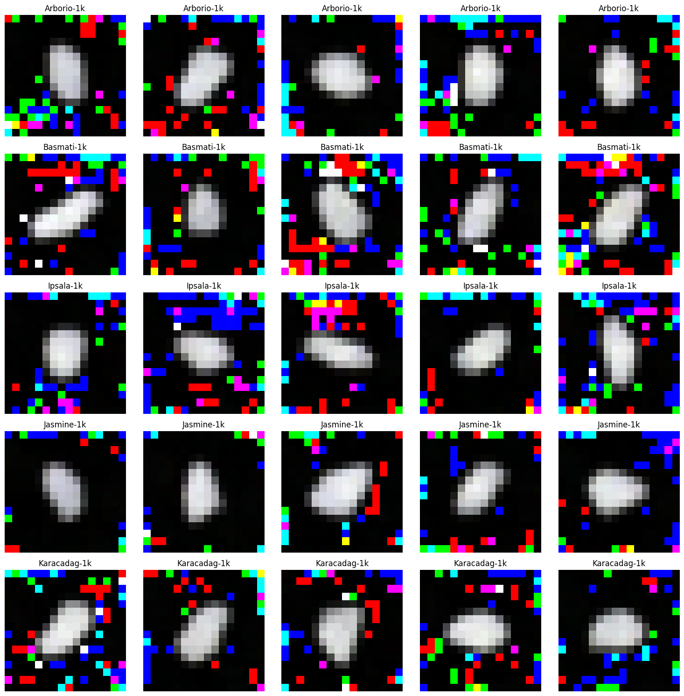
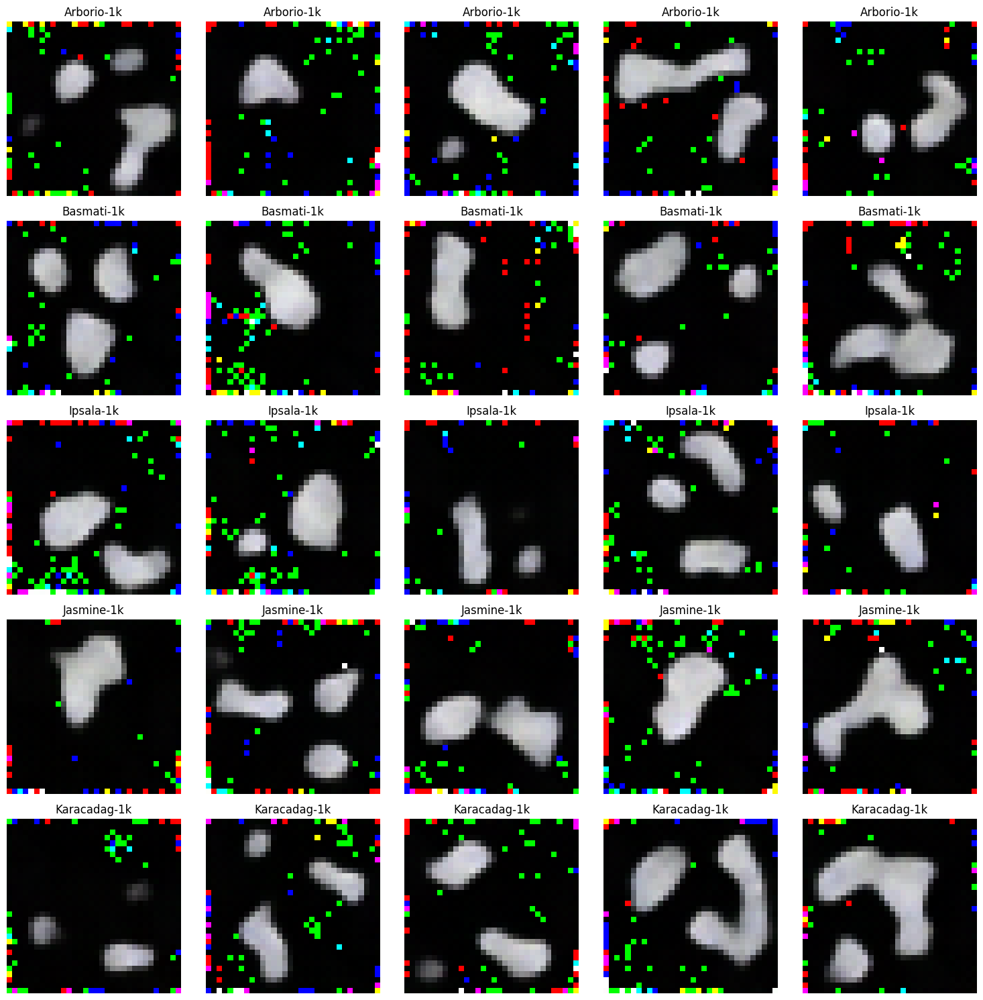
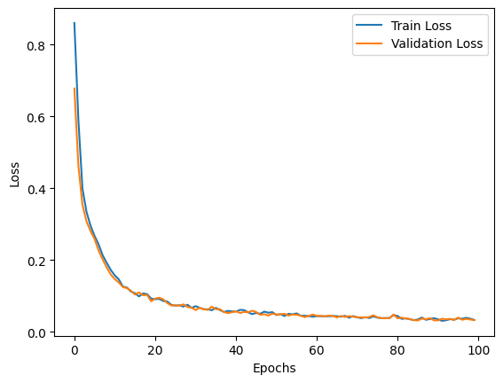

# 🍚 RiceGen 
🌾  Diffusion Model applied to rice grains generation. 🌾

<p align="center">
    
</p>

This is a simple academical project that aim to generate 
rice grains images using an unconditional diffusion model from scratch technique.
Although being unconditional, the model is fully trained with similiar rice images, 
so we can say that is *conditioned* to generate rice grains.

## Dataset and pre-processing

The chosen database was [Rice Image Dataset](https://www.kaggle.com/datasets/muratkokludataset/rice-image-dataset),
which provided images of five rice varieties (Arborio, Basmati, Ipsala, Jasmine and Karacadag), 15k images for each. As this project was executed within a Google Colab Jupyter Notebook, the size was reduced for 1k images for each variety. Using the following command:

```bash
ls | head -n 1000 | xargs -I {} mv {} ../<variety>-1k/
```

Once the data was shrinked, it was possible and feasible to use and upload to Drive. Inside Colab, after extracted the zip file that contained all the 5k images, was necessary to process these PIL images labeled into 
a PyTorch Dataset structure, using the CustomDataset and shuffling it. 4k (80%) was designed to train the model and the 20% to validation.

## The architecture

It's worth to remember that this project is highly inspired and based on [Diffusion Models - Live Coding Tutorial][1] and [Diffusion Models | Paper Explanation | Math Explained][2] using their code as foundation, as the scratch implementation requires a certain level of expertise at math, mainly statistic.

The main goal is applying noise to the images using Markov Chain, this is the forward process. Once the model is trained, it can do the reverse process, turning noise into a coherent image. The architecture uses the U-Net in the processes which is very similar to Variational Auto Encoders (VAE).

> **_NOTE:_**: I will not cover deeply the math under the hood. Just applying the concepts studied.
> If you want go further, feel free to read and watch the references.

### Parameters

There were several tests with differents parameters values (batch size, image size, learning rate and number of epochs). You can see the results inside the [5k-samples](5k-samples). Among theses options, the image with the following parameters: [BS-64_E-120_IMGSIZE-16x16](5k-samples/CLASSES_BS-64_E-120_IMGSIZE-16x16.png) was the most similar to a real grain. The [BS-64_E-120_IMGSIZE-32x32_LR-00003](5k-samples/CLASSES_BS-64_E-120_IMGSIZE-16x16_LR-00003.png) (with learning rate = 0.0003) presented a good trail as well.

## Results

Altough being limited by the Colab runtime resources, great images were accomplished. The image below has the followings parameters: Batch size = 64, Epochs = 120, Resolution = 16x16 and Learning Rate = 0.0003.

<p align="center">
    
</p>

When trying to increase the resolution, it's clearly seen that the model get instable and try to generate 
more grains, which sometimes leads to an undesired image.

<p align="center">
    
</p>

Here's how the loss function behaved in the first image (16x16 resolution).
<p align="center">
    
</p>

## References

[1]: https://www.youtube.com/watch?v=S_il77Ttrmg
[2]: https://www.youtube.com/watch?v=HoKDTa5jHvg
[3]: https://www.youtube.com/watch?v=i2qSxMVeVLI
[4]: https://arxiv.org/pdf/2208.11970.pdf
[5]: https://arxiv.org/pdf/2006.11239.pdf

1. **dtransposed**. (2023, February 6). _Introduction to Markdown_ [Video]. YouTube. Retrieved March 8, 2024, from [https://www.youtube.com/watch?v=S_il77Ttrmg][1].


2. **Outlier**. (2022, June 6). _Diffusion Models | Paper Explanation | Math Explained_ [Video]. YouTube. Retrieved March 8, 2024, from [https://www.youtube.com/watch?v=HoKDTa5jHvg][2].

3. **Jia-Bin Huang**. (2024, January 8). _Diffusion Models | Paper Explanation | Math Explained_ [Video]. YouTube. Retrieved March 8, 2024, from [https://www.youtube.com/watch?v=i2qSxMVeVLI][3].

4. Luo, C. (2022). The Effectiveness of Markdown in Document Creation. *Arxiv*. [https://arxiv.org/pdf/2208.11970.pdf](4)

5. Ho, J., Jain, A., Abbeel, P. (2020). Denoising Diffusion Probabilistic Model. *Arxiv*. [https://arxiv.org/pdf/2006.11239.pdf](5)